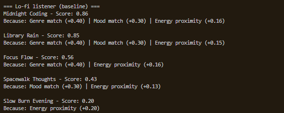
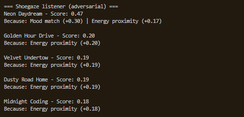
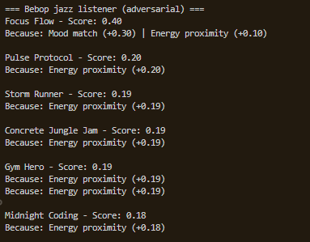

# 🎵 Music Recommender Simulation

## Project Summary

In this project you will build and explain a small music recommender system.

Your goal is to:

- Represent songs and a user "taste profile" as data
- Design a scoring rule that turns that data into recommendations
- Evaluate what your system gets right and wrong
- Reflect on how this mirrors real world AI recommenders

Replace this paragraph with your own summary of what your version does.

---

## How The System Works

Explain your design in plain language.

Some prompts to answer:

- What features does each `Song` use in your system
  - For example: genre, mood, energy, tempo: 

    + When I asked Claude what features in the dataset can best be used to recommend songs, Claude chose genre, mood, and energy, all for reasons I completely agree with because it aligns with my imitial logic around song choice. Most listeners use genre as a way to identify with the music they like, and genre is an encapsulating label that can best represent other features present within the data. However, a lot of listeners also enjoy exploring new genres but still want songs that best represent what goes on in their day. Mood and energy are both factors that I believe are factors people subconsciously associate with when choosing songs they like. Claude's logic was quite similar to mine. In addition to the encapsulating element of genre, Claude also mentioned that mood and energy best represent other features like valence and danceability, therefore, these features don't have to be considered if mood and energy are similar, if not better, ways for recommending music. 

- What information does your `UserProfile` store: 

    + UserProfile stores information on user preferences regarding genre, mood, and energy (even acoustic). 

- How does your `Recommender` compute a score for each song

    + After a recommendation form Claude and some minor tweaks, genre, mood, and energy have different weights attached to them, with genre having the highest weight and energy having the lowest score. The individual weights I want to assign to each feature is 0.4 for genre, 0.3 for mood, and 0.2 for energy. 

- How do you choose which songs to recommend

    + Claude has created this formula to calculate the total score based on weights added to genre, mood, and energy: 
      total = 0.40 * genre_score + 0.35 * mood_score + 0.25 * energy_score

    + For each song in the csv file, whichever song matches genre, mood, and energy preferences will automatically be calculated with its weight, then the score calculated before being appended into the song recommendation list. I will be choosing the top 3 songs to recommend based on top three highest scores. 

You can include a simple diagram or bullet list if helpful.

PSEUDOCODE: (Program starts here)

+ Assign user preferences in main.py 
+ 
+ read song.csv
+ 
+ create recommended_songs = {}
+ 
+ 
+  
+ 
+ for songs in songs.csv: 
+    take genre, mood, and energy from each song 
+    If genre in the list matches prefernece: 
+       genre score = 1.0 
+    if mood in the list matches preference: 
        mood_score = 1.0 
      if energy in list is around the energy of user preference: 
        eneergy_score = 1.0 - |song.energy - user.energy| 
      total = (equation we have)
      append the song name and score to the recommended_string dictionary 

+ once the for loop is finished, start reorganizing reccomended_songs dictionary 
+ only return highest three results and print it. 
    


---

## Getting Started

### Setup

1. Create a virtual environment (optional but recommended):

   ```bash
   python -m venv .venv
   source .venv/bin/activate      # Mac or Linux
   .venv\Scripts\activate         # Windows

2. Install dependencies

```bash
pip install -r requirements.txt
```

3. Run the app:

```bash
python -m src.main
```

### Running Tests

Run the starter tests with:

```bash
pytest
```

You can add more tests in `tests/test_recommender.py`.

---

## Experiments You Tried

Use this section to document the experiments you ran. For example:

- What happened when you changed the weight on genre from 2.0 to 0.5
- What happened when you added tempo or valence to the score
- How did your system behave for different types of users

(LIST OF SCREENSHOTS W/ ADVERSARIAL PROFILES): 
+ 
+ 
+ 

---

## Limitations and Risks

Summarize some limitations of your recommender.

Examples:

- It only works on a tiny catalog
- It does not understand lyrics or language
- It might over favor one genre or mood

You will go deeper on this in your model card.

---

## Reflection

Read and complete `model_card.md`:

[**Model Card**](model_card.md)

Write 1 to 2 paragraphs here about what you learned:

- about how recommenders turn data into predictions
- about where bias or unfairness could show up in systems like this

+ My biggest learning moment from working on this project is the importance of diversity in a dataset. This could greatly offer much more information, and the right type of information a user is looking for. I used AI tools when recommended by the project, such as Claude. Every single time, I will reread the code and make sure Claude is outputting code that aligned with my pseudocode. This was a process I didn't want AI to be fully independent with. Instead of algorithms offering a fresh new list of songs every refresh, the reocommender will often put together the same order of songs without diversifying or introducing new music. 

+ My biggest goal is to also expand this project to make it more impactful, starting by incorporating elements of genre-similarity values, recommended genres list associated with certain genres and moods. That way, Users can get recommended songs that align with something the would be interested in. 


---

## 7. `model_card_template.md`

Combines reflection and model card framing from the Module 3 guidance. :contentReference[oaicite:2]{index=2}  

```markdown
# 🎧 Model Card - Music Recommender Simulation

## 1. Model Name

Give your recommender a name, for example:

> VibeFinder 1.0

---

## 2. Intended Use

- What is this system trying to do
- Who is it for

Example:

> This model suggests 3 to 5 songs from a small catalog based on a user's preferred genre, mood, and energy level. It is for classroom exploration only, not for real users.

---

## 3. How It Works (Short Explanation)

Describe your scoring logic in plain language.

- What features of each song does it consider
- What information about the user does it use
- How does it turn those into a number

Try to avoid code in this section, treat it like an explanation to a non programmer.

---

## 4. Data

Describe your dataset.

- How many songs are in `data/songs.csv`
- Did you add or remove any songs
- What kinds of genres or moods are represented
- Whose taste does this data mostly reflect

---

## 5. Strengths

Where does your recommender work well

You can think about:
- Situations where the top results "felt right"
- Particular user profiles it served well
- Simplicity or transparency benefits

---

## 6. Limitations and Bias

Where does your recommender struggle

Some prompts:
- Does it ignore some genres or moods
- Does it treat all users as if they have the same taste shape
- Is it biased toward high energy or one genre by default
- How could this be unfair if used in a real product

---

## 7. Evaluation

How did you check your system

Examples:
- You tried multiple user profiles and wrote down whether the results matched your expectations
- You compared your simulation to what a real app like Spotify or YouTube tends to recommend
- You wrote tests for your scoring logic

You do not need a numeric metric, but if you used one, explain what it measures.

---

## 8. Future Work

If you had more time, how would you improve this recommender

Examples:

- Add support for multiple users and "group vibe" recommendations
- Balance diversity of songs instead of always picking the closest match
- Use more features, like tempo ranges or lyric themes

---

## 9. Personal Reflection

A few sentences about what you learned:

- What surprised you about how your system behaved
- How did building this change how you think about real music recommenders
- Where do you think human judgment still matters, even if the model seems "smart"

